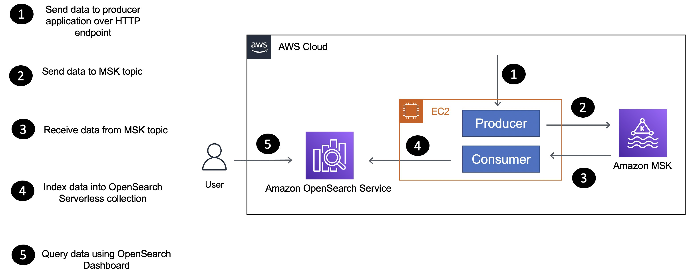

## Ingesting Data into OpenSearch using Apache Kafka and Go

Scalable data ingestion is a key aspect for a large-scale distributed search and analytics engine like [OpenSearch](https://opensearch.org/). Sometimes there are specific requirements in your data pipeline which might need you to write your own integration layer. 

[This blog post](https://community.aws/posts/opensearch-kafka-golang-data-ingestion) covers how to create a data pipeline wherein data written into Apache Kafka is ingested into [OpenSearch](https://opensearch.org/). We will make use of a custom [Go](http://go.dev/) application to ingest data using Go clients for [Kafka](https://github.com/twmb/franz-go) and [OpenSearch](https://opensearch.org/docs/latest/clients/go/). 

Here is a simplified version of the application architecture that outlines the components and how they interact with each other.

The application consists of producer and consumer components, which are Go applications deployed to an `EC2` instance):

- The producer sends data to the MSK Serverless cluster.
- The consumer application receives data (`movie` information) from the MSK Serverless topic and uses the OpenSearch Go client to index data in the `movies` collection.

## Security

See [CONTRIBUTING](CONTRIBUTING.md#security-issue-notifications) for more information.

## License

This library is licensed under the MIT-0 License. See the LICENSE file.

